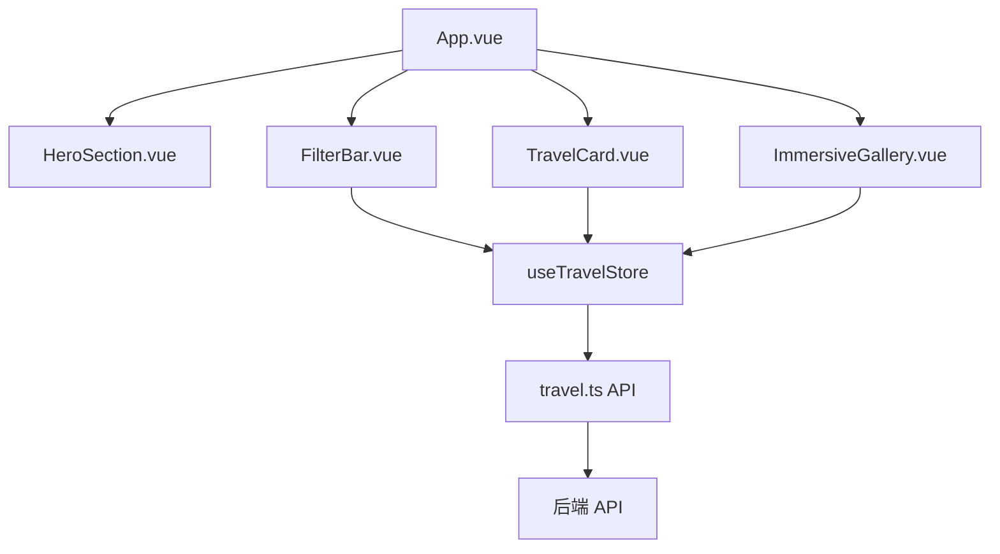
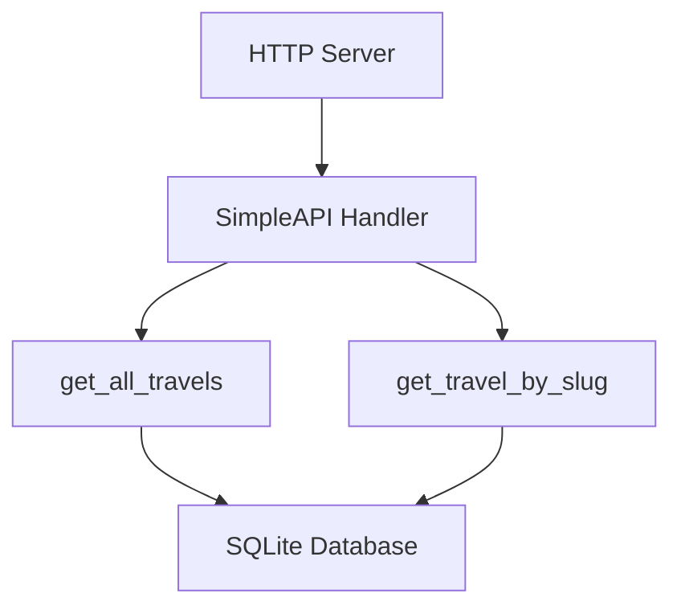

# 旅行体验平台 - 技术架构文档

## 1. 技术栈

### 前端
- **框架**：Vue 3 + TypeScript
- **构建工具**：Vite
- **状态管理**：Pinia
- **HTTP 客户端**：Axios
- **路由**：Vue Router
- **CSS**：原生 CSS（使用 scoped 样式）

### 后端
- **语言**：Python 3
- **服务器**：内置 HTTP 服务器
- **数据库**：SQLite
- **API 格式**：RESTful JSON

## 2. 架构设计

### 前端架构



### 后端架构



## 3. 目录结构

### 前端

```
frontend/
├── src/
│   ├── api/             # API 调用
│   │   └── travel.ts    # 旅行数据 API
│   ├── components/      # 组件
│   │   ├── FilterBar.vue    # 筛选栏组件
│   │   ├── HeroSection.vue  # 英雄区组件
│   │   ├── ImmersiveGallery.vue # 沉浸式画廊组件
│   │   └── TravelCard.vue   # 旅行卡片组件
│   ├── stores/          # 状态管理
│   │   └── travel.ts    # 旅行数据状态管理
│   ├── views/           # 页面
│   │   └── Detail.vue   # 详情页面
│   ├── App.vue          # 应用入口
│   └── main.ts          # 主入口
├── package.json         # 依赖配置
└── vite.config.ts       # Vite 配置
```

### 后端

```
backend/
├── simple_server.py     # 后端服务器
├── create_db.py         # 数据库创建脚本
└── travels.db           # SQLite 数据库
```

## 4. 核心功能实现

### 4.1 数据获取与状态管理

- **状态管理**：使用 Pinia 管理旅行数据和筛选状态
- **数据获取**：通过 Axios 从后端 API 获取数据
- **数据缓存**：将获取的数据存储在 Pinia store 中，避免重复请求

### 4.2 筛选功能

- **多维度筛选**：支持按体验类型、视觉风格、小众程度和情感基调筛选
- **前端筛选**：在前端实现筛选逻辑，减少后端请求
- **实时更新**：筛选条件变化时，实时更新卡片列表

### 4.3 详情查看

- **弹窗展示**：使用 Teleport 组件实现详情弹窗
- **沉浸式体验**：弹窗展示旅行的详细信息和画廊图片
- **响应式设计**：弹窗适应不同屏幕尺寸

### 4.4 响应式布局

- **网格布局**：使用 CSS Grid 实现响应式卡片布局
- **媒体查询**：根据屏幕尺寸调整布局和样式
- **移动端适配**：在小屏幕设备上优化用户体验

## 5. API 接口

### 5.1 获取所有旅行数据

- **URL**：`/api/v1/travels`
- **方法**：GET
- **响应**：
  ```json
  [
    {
      "id": 1,
      "title": "在辐射与废墟之间，听见时间的停顿",
      "slug": "chernobyl-ruins",
      "visual_hook": "Pripyat silence heavier than death",
      "content_story": "我站在切尔诺贝利的废墟中...",
      "cover_url": "https://picsum.photos/seed/chernobyl/800/600",
      "gallery_urls": ["https://picsum.photos/seed/chernobyl1/800/600", "https://picsum.photos/seed/chernobyl2/800/600"],
      "experience_type": "Extreme",
      "visual_style": "BlackWhite",
      "rarity_level": "Rare",
      "emotional_tone": "Awe"
    },
    ...
  ]
  ```

### 5.2 获取单个旅行数据

- **URL**：`/api/v1/travels/{slug}`
- **方法**：GET
- **响应**：
  ```json
  {
    "id": 1,
    "title": "在辐射与废墟之间，听见时间的停顿",
    "slug": "chernobyl-ruins",
    "visual_hook": "Pripyat silence heavier than death",
    "content_story": "我站在切尔诺贝利的废墟中...",
    "cover_url": "https://picsum.photos/seed/chernobyl/800/600",
    "gallery_urls": ["https://picsum.photos/seed/chernobyl1/800/600", "https://picsum.photos/seed/chernobyl2/800/600"],
    "experience_type": "Extreme",
    "visual_style": "BlackWhite",
    "rarity_level": "Rare",
    "emotional_tone": "Awe"
  }
  ```

## 6. 部署与运行

### 6.1 后端部署

1. 进入后端目录：`cd backend`
2. 运行数据库创建脚本：`python create_db.py`
3. 启动后端服务器：`python simple_server.py`
4. 后端服务器将在 `http://localhost:8000` 运行

### 6.2 前端部署

1. 进入前端目录：`cd frontend`
2. 安装依赖：`npm install`
3. 启动开发服务器：`npm run dev`
4. 前端服务器将在 `http://localhost:5200` 运行

### 6.3 生产部署

1. 前端构建：`npm run build`
2. 将构建产物部署到静态文件服务器
3. 后端服务器可以部署到任何支持 Python 的环境
