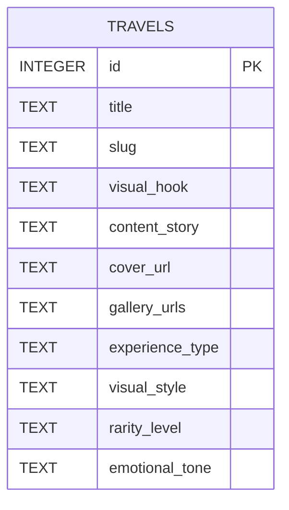

# 旅行体验平台 - 实体关系图

## 数据库表结构

### travels 表

| 字段名 | 数据类型 | 约束 | 描述 |
| :--- | :--- | :--- | :--- |
| `id` | `INTEGER` | `PRIMARY KEY AUTOINCREMENT` | 旅行体验 ID |
| `title` | `TEXT` | `NOT NULL` | 旅行体验标题 |
| `slug` | `TEXT` | `NOT NULL UNIQUE` | 旅行体验路径 |
| `visual_hook` | `TEXT` | `NOT NULL` | 视觉钩子 |
| `content_story` | `TEXT` | `NOT NULL` | 故事内容 |
| `cover_url` | `TEXT` | `NOT NULL` | 封面图片 URL |
| `gallery_urls` | `TEXT` | | 画廊图片 URL 数组（JSON 字符串） |
| `experience_type` | `TEXT` | `NOT NULL` | 体验类型 |
| `visual_style` | `TEXT` | `NOT NULL` | 视觉风格 |
| `rarity_level` | `TEXT` | `NOT NULL` | 小众程度 |
| `emotional_tone` | `TEXT` | `NOT NULL` | 情感基调 |

## 实体关系图

## 数据类型说明

- **id**：自增主键，用于唯一标识每条旅行体验记录。
- **title**：旅行体验的标题，不能为空。
- **slug**：旅行体验的路径，用于构建 URL，不能为空且唯一。
- **visual_hook**：旅行体验的视觉钩子，用于吸引用户，不能为空。
- **content_story**：旅行体验的故事内容，不能为空。
- **cover_url**：旅行体验的封面图片 URL，不能为空。
- **gallery_urls**：旅行体验的画廊图片 URL 数组，存储为 JSON 字符串。
- **experience_type**：旅行体验的类型，不能为空。
- **visual_style**：旅行体验的视觉风格，不能为空。
- **rarity_level**：旅行体验的小众程度，不能为空。
- **emotional_tone**：旅行体验的情感基调，不能为空。

## 表关系

本项目只有一个 `travels` 表，不涉及表之间的关系。所有数据都存储在这个表中，通过不同的字段来表示旅行体验的各种属性。
