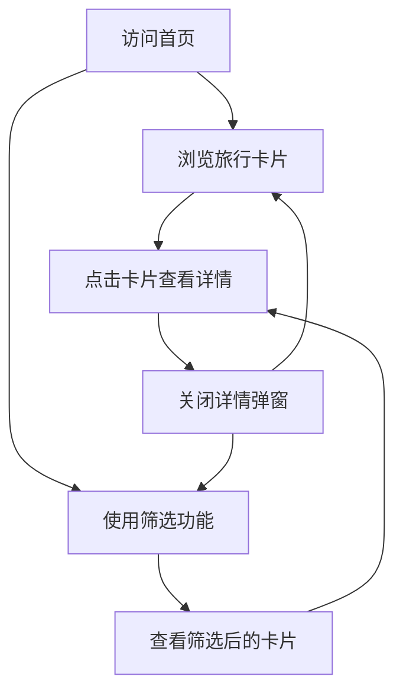

# 旅行体验平台 - 产品需求文档

## 1. 产品概览

旅行体验平台是一个展示和筛选特色旅行体验的单页应用，旨在为用户提供独特、沉浸式的旅行灵感。

- 该平台通过精美的视觉设计和详细的内容描述，为用户展示各种特色旅行体验，如切尔诺贝利废墟、冰岛黑洞探险等。
- 平台提供多维度的筛选功能，允许用户根据体验类型、视觉风格、小众程度和情感基调等维度筛选旅行体验。
- 平台采用响应式设计，适配不同屏幕尺寸，为用户提供良好的浏览体验。

## 2. 核心功能

### 2.1 用户角色

| 角色 | 注册方式 | 核心权限 |
|------|----------|----------|
| 普通用户 | 无需注册 | 浏览旅行体验、使用筛选功能、查看旅行详情 |

### 2.2 功能模块

我们的旅行体验平台包含以下主要页面：

1. **首页**：展示旅行体验卡片列表、多维度筛选功能、英雄区。

### 2.3 页面详情

| 页面名称 | 模块名称 | 功能描述 |
|----------|----------|----------|
| 首页 | 英雄区 | 展示平台名称和主题，吸引用户注意 |
| 首页 | 筛选栏 | 提供多维度筛选功能，包括体验类型、视觉风格、小众程度和情感基调 |
| 首页 | 旅行卡片列表 | 展示旅行体验卡片，每个卡片包含标题、视觉钩子、故事预览和标签 |
| 首页 | 详情弹窗 | 点击卡片后显示，展示旅行的详细信息，包括标题、视觉钩子、故事内容和画廊图片 |

## 3. 核心流程

用户浏览旅行体验的流程如下：

1. 用户访问首页，看到英雄区和旅行卡片列表。
2. 用户可以直接浏览卡片列表，点击感兴趣的卡片查看详情。
3. 用户也可以使用筛选功能，根据自己的偏好筛选旅行体验。
4. 筛选后，卡片列表会更新，只显示符合筛选条件的旅行体验。
5. 用户可以点击筛选后的卡片查看详情。
6. 查看详情后，用户可以关闭弹窗，继续浏览或筛选。

## 4. 用户接口设计

### 4.1 设计风格

- **主色调**：黑色背景，白色文字，营造沉浸式、高端的视觉体验。
- **按钮样式**：圆角按钮，悬停效果，渐变背景。
- **字体**：Inter 字体，现代、简洁。
- **布局**：响应式网格布局，卡片式设计，视觉层次感强。
- **图标**：简洁的线性图标，与整体风格一致。

### 4.2 页面设计概览

| 页面名称 | 模块名称 | UI元素 |
|----------|----------|--------|
| 首页 | 英雄区 | 全屏背景图片，渐变叠加，大标题，副标题 |
| 首页 | 筛选栏 | 网格布局的筛选按钮，激活状态有明显视觉反馈 |
| 首页 | 旅行卡片列表 | 响应式网格布局的卡片，包含图片、标题、描述和标签 |
| 首页 | 详情弹窗 | 全屏覆盖，内容居中，包含图片、标题、描述和画廊 |

### 4.3 自适应

- 桌面端：多列卡片布局，完整的筛选栏。
- 平板端：减少卡片列数，调整筛选栏布局。
- 移动端：单列卡片布局，筛选栏垂直排列。

## 5. 数据需求

### 5.1 数据实体

| 实体 | 字段 | 类型 | 描述 |
|------|------|------|------|
| 旅行体验 | id | number | 唯一标识 |
| 旅行体验 | title | string | 标题 |
| 旅行体验 | slug | string | 路径 |
| 旅行体验 | visual_hook | string | 视觉钩子 |
| 旅行体验 | content_story | string | 故事内容 |
| 旅行体验 | cover_url | string | 封面图片URL |
| 旅行体验 | gallery_urls | string[] | 画廊图片URL数组 |
| 旅行体验 | experience_type | string | 体验类型 |
| 旅行体验 | visual_style | string | 视觉风格 |
| 旅行体验 | rarity_level | string | 小众程度 |
| 旅行体验 | emotional_tone | string | 情感基调 |

### 5.2 数据接口

| 接口路径 | 方法 | 功能描述 | 请求参数 | 响应数据 |
|----------|------|----------|----------|----------|
| /api/v1/travels | GET | 获取所有旅行体验 | 无 | 旅行体验数组 |
| /api/v1/travels/{slug} | GET | 获取单个旅行体验 | slug: string | 旅行体验对象 |
